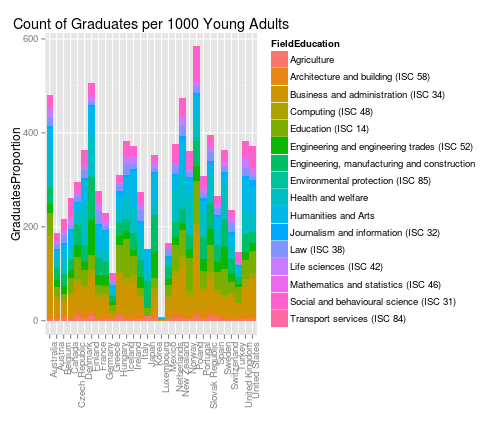

## Overview of Graduates by Country

* This shiny app offers a view into the number of graduates by field of study and compared to the number of Young Adults (ages 20 - 40) in each country.
* The goal is to show what countries have been successful in implementing policies that increase the number of graduates in higher education (tertiary level).  The application also shows what are the most demanded fields of study in each country.
* You can access the application here http://arracadas.shinyapps.io/project/
* The R documentation is available here http://github.com/arracadas/shinygrads

---

## Graduates by Country Overtime

The first graph is a GoogleVis motion chart showing Graduates vs. Young Adults by Country over time.  In most countries the total number of Young Adults has remained almost the same, but graduates have increased significantly in countries like Poland.


```r
suppressPackageStartupMessages(library(googleVis))
yp <- gvisMotionChart(y1
                      ,"CountryName"
                      ,"Year"
                      ,options=list(width=600
                                    ,height=400
                                    )
                      )
print(yp, "chart")
```

<!-- MotionChart generated in R 3.1.2 by googleVis 0.5.8 package -->
<!-- Sat Feb 21 23:39:34 2015 -->


<!-- jsHeader -->
<script type="text/javascript">
 
// jsData 
function gvisDataMotionChartID26c428085eec () {
var data = new google.visualization.DataTable();
var datajson =
[
 [
 "Australia",
1998,
"AUS",
136166,
4352000 
],
[
 "Australia",
1999,
"AUS",
163291,
5649000 
],
[
 "Australia",
2000,
"AUS",
155763,
5631000 
],
[
 "Australia",
2001,
"AUS",
173495,
5625000 
],
[
 "Australia",
2002,
"AUS",
184002,
5637000 
],
[
 "Australia",
2003,
"AUS",
197586,
5660000 
],
[
 "Australia",
2004,
"AUS",
219470,
5685000 
],
[
 "Australia",
2005,
"AUS",
235296,
5737000 
],
[
 "Australia",
2006,
"AUS",
243479,
5813000 
],
[
 "Australia",
2007,
"AUS",
249196,
5927000 
],
[
 "Australia",
2008,
"AUS",
251409,
6074000 
],
[
 "Australia",
2010,
"AUS",
274669,
6331000 
],
[
 "Australia",
2011,
"AUS",
289679,
6380000 
],
[
 "Austria",
1998,
"AUT",
7551,
2464958 
],
[
 "Austria",
1999,
"AUT",
17636,
2436011 
],
[
 "Austria",
2000,
"AUT",
18918,
2408584 
],
[
 "Austria",
2001,
"AUT",
20940,
2386316 
],
[
 "Austria",
2002,
"AUT",
21232,
2368537 
],
[
 "Austria",
2003,
"AUT",
22798,
2348893 
],
[
 "Austria",
2004,
"AUT",
25651,
2331651 
],
[
 "Austria",
2005,
"AUT",
27035,
2315942 
],
[
 "Austria",
2006,
"AUT",
29351,
2293469 
],
[
 "Austria",
2007,
"AUT",
31693,
2266235 
],
[
 "Austria",
2008,
"AUT",
38439,
2239851 
],
[
 "Austria",
2010,
"AUT",
48668,
2192690 
],
[
 "Austria",
2011,
"AUT",
54105,
2184417 
],
[
 "Austria",
2012,
"AUT",
59316,
2188827 
],
[
 "Belgium",
2000,
"BEL",
35063,
2887353 
],
[
 "Belgium",
2001,
"BEL",
36978,
2866924 
],
[
 "Belgium",
2002,
"BEL",
37862,
2850954 
],
[
 "Belgium",
2003,
"BEL",
39251,
2830512 
],
[
 "Belgium",
2004,
"BEL",
40649,
2804410 
],
[
 "Belgium",
2005,
"BEL",
42446,
2782944 
],
[
 "Belgium",
2006,
"BEL",
43142,
2772510 
],
[
 "Belgium",
2007,
"BEL",
67857,
2772545 
],
[
 "Belgium",
2008,
"BEL",
61939,
2781414 
],
[
 "Belgium",
2010,
"BEL",
66506,
2823406 
],
[
 "Belgium",
2011,
"BEL",
67734,
2857949 
],
[
 "Belgium",
2012,
"BEL",
69754,
2873569 
],
[
 "Canada",
1998,
"CAN",
151399,
9199571 
],
[
 "Canada",
1999,
"CAN",
153271,
9132421 
],
[
 "Canada",
2000,
"CAN",
157017,
9084161 
],
[
 "Canada",
2004,
"CAN",
178650,
8933305 
],
[
 "Canada",
2005,
"CAN",
211683,
8911136 
],
[
 "Canada",
2006,
"CAN",
215610,
8930568 
],
[
 "Canada",
2007,
"CAN",
202524,
9001396 
],
[
 "Canada",
2008,
"CAN",
225982.54,
9099512 
],
[
 "Canada",
2009,
"CAN",
224082,
9226539 
],
[
 "Canada",
2010,
"CAN",
222711.47,
9359113 
],
[
 "Canada",
2011,
"CAN",
225435,
9464514 
],
[
 "Canada",
2012,
"CAN",
232096,
9606909 
],
[
 "Switzerland",
1998,
"CHE",
24767,
2117675 
],
[
 "Switzerland",
1999,
"CHE",
27707,
2100640 
],
[
 "Switzerland",
2000,
"CHE",
28872,
2087503 
],
[
 "Switzerland",
2001,
"CHE",
28673,
2092001 
],
[
 "Switzerland",
2003,
"CHE",
29630,
2080202 
],
[
 "Switzerland",
2004,
"CHE",
30916,
2064803 
],
[
 "Switzerland",
2005,
"CHE",
34252,
2047308 
],
[
 "Switzerland",
2006,
"CHE",
39681,
2031186 
],
[
 "Switzerland",
2007,
"CHE",
43615,
2030058 
],
[
 "Switzerland",
2008,
"CHE",
46474,
2048680 
],
[
 "Switzerland",
2009,
"CHE",
47791,
2052522 
],
[
 "Switzerland",
2010,
"CHE",
51533,
2074122.5 
],
[
 "Switzerland",
2011,
"CHE",
53281,
2110087 
],
[
 "Czech Republic",
1998,
"CZE",
26084,
3006827 
],
[
 "Czech Republic",
1999,
"CZE",
28021,
3049697 
],
[
 "Czech Republic",
2000,
"CZE",
32849,
3086459 
],
[
 "Czech Republic",
2001,
"CZE",
35394,
3088079 
],
[
 "Czech Republic",
2002,
"CZE",
37739,
3095723 
],
[
 "Czech Republic",
2003,
"CZE",
41892,
3104232 
],
[
 "Czech Republic",
2004,
"CZE",
50099,
3103165 
],
[
 "Czech Republic",
2005,
"CZE",
53956,
3110366 
],
[
 "Czech Republic",
2006,
"CZE",
63852,
3126281 
],
[
 "Czech Republic",
2007,
"CZE",
75040,
3156765 
],
[
 "Czech Republic",
2008,
"CZE",
86026,
3207931 
],
[
 "Czech Republic",
2009,
"CZE",
93426,
3231896 
],
[
 "Czech Republic",
2010,
"CZE",
99525,
3227547 
],
[
 "Czech Republic",
2011,
"CZE",
102664,
3165982 
],
[
 "Czech Republic",
2012,
"CZE",
103698,
3138998 
],
[
 "Germany",
1998,
"DEU",
236586,
24370241 
],
[
 "Germany",
1999,
"DEU",
235302,
24012386 
],
[
 "Germany",
2000,
"DEU",
227508,
23668883 
],
[
 "Germany",
2001,
"DEU",
220530,
23343072 
],
[
 "Germany",
2002,
"DEU",
221101,
23006866 
],
[
 "Germany",
2003,
"DEU",
228225,
22595705 
],
[
 "Germany",
2004,
"DEU",
241873,
22112788 
],
[
 "Germany",
2005,
"DEU",
262926,
21631070 
],
[
 "Germany",
2006,
"DEU",
330781,
21177803 
],
[
 "Germany",
2007,
"DEU",
357942,
20765490 
],
[
 "Germany",
2008,
"DEU",
388439,
20387910 
],
[
 "Germany",
2009,
"DEU",
426346,
20044224 
],
[
 "Germany",
2010,
"DEU",
455452,
19822096 
],
[
 "Germany",
2011,
"DEU",
494164,
19717296 
],
[
 "Germany",
2012,
"DEU",
523430,
19701954 
],
[
 "Denmark",
1999,
"DNK",
13138,
1545030 
],
[
 "Denmark",
2000,
"DNK",
15480,
1533684 
],
[
 "Denmark",
2001,
"DNK",
34568,
1518395 
],
[
 "Denmark",
2002,
"DNK",
34744,
1500295 
],
[
 "Denmark",
2003,
"DNK",
38259,
1477213 
],
[
 "Denmark",
2004,
"DNK",
41697,
1450126 
],
[
 "Denmark",
2005,
"DNK",
44946,
1423963 
],
[
 "Denmark",
2006,
"DNK",
43237,
1399616 
],
[
 "Denmark",
2007,
"DNK",
46874,
1382874 
],
[
 "Denmark",
2008,
"DNK",
45777,
1378601 
],
[
 "Denmark",
2010,
"DNK",
50060,
1379825 
],
[
 "Denmark",
2011,
"DNK",
52923,
1380543 
],
[
 "Denmark",
2012,
"DNK",
54492,
1380789 
],
[
 "Spain",
1998,
"ESP",
223185,
12824078 
],
[
 "Spain",
1999,
"ESP",
244967,
12926058 
],
[
 "Spain",
2000,
"ESP",
226870,
13078374 
],
[
 "Spain",
2001,
"ESP",
233360,
13262907 
],
[
 "Spain",
2002,
"ESP",
234345,
13462203 
],
[
 "Spain",
2003,
"ESP",
233573,
13661755 
],
[
 "Spain",
2004,
"ESP",
226106,
13827330 
],
[
 "Spain",
2005,
"ESP",
220472,
13981805 
],
[
 "Spain",
2006,
"ESP",
217623,
14108834 
],
[
 "Spain",
2007,
"ESP",
211299,
14231317 
],
[
 "Spain",
2008,
"ESP",
225796,
14280489 
],
[
 "Spain",
2009,
"ESP",
238938,
14118396 
],
[
 "Spain",
2010,
"ESP",
263827,
13832972 
],
[
 "Spain",
2011,
"ESP",
311333,
13507940 
],
[
 "Spain",
2012,
"ESP",
305497,
13108379 
],
[
 "Finland",
1998,
"FIN",
26672,
1387000 
],
[
 "Finland",
1999,
"FIN",
28544,
1377000 
],
[
 "Finland",
2000,
"FIN",
32712,
1365000 
],
[
 "Finland",
2001,
"FIN",
35172,
1354000 
],
[
 "Finland",
2002,
"FIN",
39280,
1345000 
],
[
 "Finland",
2003,
"FIN",
42478,
1338000 
],
[
 "Finland",
2004,
"FIN",
43537,
1330000 
],
[
 "Finland",
2005,
"FIN",
44001,
1326000 
],
[
 "Finland",
2006,
"FIN",
45254,
1318000 
],
[
 "Finland",
2007,
"FIN",
48279,
1313000 
],
[
 "Finland",
2008,
"FIN",
64052,
1311000 
],
[
 "Finland",
2009,
"FIN",
50347,
1315000 
],
[
 "Finland",
2010,
"FIN",
59046,
1322000 
],
[
 "Finland",
2011,
"FIN",
57103,
1333000 
],
[
 "Finland",
2012,
"FIN",
59675,
1347000 
],
[
 "France",
1998,
"FRA",
155787,
16626416 
],
[
 "France",
1999,
"FRA",
162035,
16524377 
],
[
 "France",
2000,
"FRA",
370806,
16469302 
],
[
 "France",
2001,
"FRA",
375667.007,
16442258 
],
[
 "France",
2002,
"FRA",
399579,
16420480 
],
[
 "France",
2003,
"FRA",
430847,
16370460 
],
[
 "France",
2004,
"FRA",
431016,
16294896 
],
[
 "France",
2005,
"FRA",
472256,
16243494 
],
[
 "France",
2006,
"FRA",
445109,
16203953 
],
[
 "France",
2007,
"FRA",
423141,
16156420 
],
[
 "France",
2008,
"FRA",
425716,
16106926 
],
[
 "France",
2009,
"FRA",
424679,
16048252 
],
[
 "France",
2010,
"FRA",
0,
15972959 
],
[
 "France",
2011,
"FRA",
0,
15876389 
],
[
 "France",
2012,
"FRA",
0,
15760081 
],
[
 "United Kingdom",
1998,
"GBR",
247458.43,
16811000 
],
[
 "United Kingdom",
1999,
"GBR",
253702.381,
16762000 
],
[
 "United Kingdom",
2000,
"GBR",
371010.931,
16758000 
],
[
 "United Kingdom",
2001,
"GBR",
439804.692,
16723000 
],
[
 "United Kingdom",
2003,
"GBR",
469383.8702,
16514000 
],
[
 "United Kingdom",
2005,
"GBR",
509385.41,
16314000 
],
[
 "United Kingdom",
2006,
"GBR",
525941.12,
16328000 
],
[
 "United Kingdom",
2007,
"GBR",
535236.38,
16348000 
],
[
 "United Kingdom",
2008,
"GBR",
549577.25,
16384000 
],
[
 "United Kingdom",
2009,
"GBR",
551707.71,
16373000 
],
[
 "United Kingdom",
2010,
"GBR",
592818.9,
16508000 
],
[
 "United Kingdom",
2011,
"GBR",
637897.99,
16923000 
],
[
 "United Kingdom",
2012,
"GBR",
670591,
16926300 
],
[
 "Greece",
2001,
"GRC",
0,
3299000 
],
[
 "Greece",
2002,
"GRC",
0,
3313000 
],
[
 "Greece",
2003,
"GRC",
0,
3326000 
],
[
 "Greece",
2004,
"GRC",
34438,
3336000 
],
[
 "Greece",
2005,
"GRC",
42409,
3333000 
],
[
 "Greece",
2006,
"GRC",
11434,
3320000 
],
[
 "Greece",
2007,
"GRC",
43498,
3291000 
],
[
 "Greece",
2008,
"GRC",
49372,
3253000 
],
[
 "Greece",
2010,
"GRC",
47868,
3138000 
],
[
 "Greece",
2011,
"GRC",
47974,
3069000 
],
[
 "Greece",
2012,
"GRC",
49628,
2997000 
],
[
 "Hungary",
1998,
"HUN",
46220,
2866595 
],
[
 "Hungary",
1999,
"HUN",
51818,
2885944 
],
[
 "Hungary",
2000,
"HUN",
60975,
2902581 
],
[
 "Hungary",
2001,
"HUN",
55061,
2918589 
],
[
 "Hungary",
2002,
"HUN",
60242,
2934727 
],
[
 "Hungary",
2003,
"HUN",
63521,
2947046 
],
[
 "Hungary",
2004,
"HUN",
71700,
2959137 
],
[
 "Hungary",
2005,
"HUN",
68506,
2974244 
],
[
 "Hungary",
2006,
"HUN",
64775,
2987005 
],
[
 "Hungary",
2007,
"HUN",
62123,
2985810 
],
[
 "Hungary",
2008,
"HUN",
58255,
2973693 
],
[
 "Hungary",
2009,
"HUN",
63608,
2960785 
],
[
 "Hungary",
2010,
"HUN",
64159,
2946706 
],
[
 "Hungary",
2011,
"HUN",
60017,
2880036 
],
[
 "Hungary",
2012,
"HUN",
61317,
2812017 
],
[
 "Ireland",
1998,
"IRL",
23842,
1106500 
],
[
 "Ireland",
1999,
"IRL",
24891,
1129000 
],
[
 "Ireland",
2000,
"IRL",
28020,
1159000 
],
[
 "Ireland",
2001,
"IRL",
27460,
1192100 
],
[
 "Ireland",
2002,
"IRL",
29750,
1236600 
],
[
 "Ireland",
2003,
"IRL",
35971,
1263900 
],
[
 "Ireland",
2004,
"IRL",
37254,
1290100 
],
[
 "Ireland",
2005,
"IRL",
37182,
1332600 
],
[
 "Ireland",
2006,
"IRL",
21519,
1391000 
],
[
 "Ireland",
2007,
"IRL",
24679,
1468100 
],
[
 "Ireland",
2008,
"IRL",
22847,
1500000 
],
[
 "Ireland",
2009,
"IRL",
42965,
1485800 
],
[
 "Ireland",
2010,
"IRL",
43118,
1448800 
],
[
 "Ireland",
2011,
"IRL",
45414,
1418000 
],
[
 "Ireland",
2012,
"IRL",
45951,
1375500 
],
[
 "Iceland",
1998,
"ISL",
1077,
82461 
],
[
 "Iceland",
1999,
"ISL",
1288,
83184 
],
[
 "Iceland",
2000,
"ISL",
1599,
84292 
],
[
 "Iceland",
2001,
"ISL",
1797,
85195 
],
[
 "Iceland",
2002,
"ISL",
1948,
85324 
],
[
 "Iceland",
2003,
"ISL",
2266,
84755 
],
[
 "Iceland",
2004,
"ISL",
2667,
84613 
],
[
 "Iceland",
2005,
"ISL",
2838,
84644 
],
[
 "Iceland",
2006,
"ISL",
3338,
87509 
],
[
 "Iceland",
2007,
"ISL",
3547,
89975 
],
[
 "Iceland",
2008,
"ISL",
3577,
94147 
],
[
 "Iceland",
2009,
"ISL",
3528,
92793 
],
[
 "Iceland",
2010,
"ISL",
4268,
91163 
],
[
 "Italy",
1998,
"ITA",
185024,
17397991 
],
[
 "Italy",
1999,
"ITA",
198337,
17274629 
],
[
 "Italy",
2000,
"ITA",
211698,
17104878 
],
[
 "Italy",
2001,
"ITA",
221501,
16911184 
],
[
 "Italy",
2002,
"ITA",
236909,
16743462 
],
[
 "Italy",
2003,
"ITA",
266025,
16681845 
],
[
 "Italy",
2004,
"ITA",
356274,
16647300 
],
[
 "Italy",
2005,
"ITA",
413548,
16492024 
],
[
 "Italy",
2006,
"ITA",
412581,
16247567 
],
[
 "Italy",
2007,
"ITA",
431258,
16057599 
],
[
 "Italy",
2008,
"ITA",
252414,
15927262 
],
[
 "Italy",
2009,
"ITA",
245959,
15748699 
],
[
 "Italy",
2010,
"ITA",
232756,
15547218 
],
[
 "Italy",
2011,
"ITA",
401562,
15456230 
],
[
 "Italy",
2012,
"ITA",
382676,
15267808 
],
[
 "Japan",
1998,
"JPN",
322766,
35336000 
],
[
 "Japan",
1999,
"JPN",
326511,
35379000 
],
[
 "Japan",
2000,
"JPN",
329941,
35171000 
],
[
 "Japan",
2001,
"JPN",
340807,
35243000 
],
[
 "Japan",
2002,
"JPN",
345483,
35197000 
],
[
 "Japan",
2003,
"JPN",
346258,
35134000 
],
[
 "Japan",
2004,
"JPN",
343701,
34960000 
],
[
 "Japan",
2005,
"JPN",
347664,
34262000 
],
[
 "Japan",
2006,
"JPN",
351621,
34243000 
],
[
 "Japan",
2007,
"JPN",
356748,
33822000 
],
[
 "Japan",
2008,
"JPN",
357334,
33340000 
],
[
 "Japan",
2009,
"JPN",
360533,
32721000 
],
[
 "Japan",
2010,
"JPN",
349111,
32201000 
],
[
 "Japan",
2011,
"JPN",
354311,
31394000 
],
[
 "Japan",
2012,
"JPN",
364304,
30573000 
],
[
 "Korea",
1998,
"KOR",
260732,
16899376 
],
[
 "Korea",
1999,
"KOR",
272363,
16778364 
],
[
 "Korea",
2000,
"KOR",
289656,
16728366 
],
[
 "Korea",
2001,
"KOR",
322716,
16705500 
],
[
 "Korea",
2002,
"KOR",
330980,
16633386 
],
[
 "Korea",
2003,
"KOR",
348031,
16537558 
],
[
 "Korea",
2004,
"KOR",
358946,
16366968 
],
[
 "Korea",
2005,
"KOR",
364221,
16121080 
],
[
 "Korea",
2006,
"KOR",
362208,
15966616 
],
[
 "Korea",
2007,
"KOR",
371653,
15781329 
],
[
 "Korea",
2008,
"KOR",
459833,
15594878 
],
[
 "Korea",
2009,
"KOR",
456293,
15358917 
],
[
 "Korea",
2010,
"KOR",
453926,
15129799 
],
[
 "Korea",
2011,
"KOR",
475071,
15005415 
],
[
 "Korea",
2012,
"KOR",
480849,
14829521 
],
[
 "Luxembourg",
1998,
"LUX",
0,
129582 
],
[
 "Luxembourg",
1999,
"LUX",
0,
129995 
],
[
 "Luxembourg",
2000,
"LUX",
90,
132004 
],
[
 "Luxembourg",
2002,
"LUX",
0,
133373 
],
[
 "Luxembourg",
2003,
"LUX",
0,
133393 
],
[
 "Luxembourg",
2004,
"LUX",
0,
133686 
],
[
 "Luxembourg",
2005,
"LUX",
0,
134083 
],
[
 "Luxembourg",
2006,
"LUX",
0,
134957 
],
[
 "Luxembourg",
2007,
"LUX",
0,
136015 
],
[
 "Luxembourg",
2008,
"LUX",
293,
138040 
],
[
 "Luxembourg",
2009,
"LUX",
0,
140322 
],
[
 "Luxembourg",
2010,
"LUX",
0,
142434 
],
[
 "Luxembourg",
2011,
"LUX",
0,
145987 
],
[
 "Luxembourg",
2012,
"LUX",
864,
150488 
],
[
 "Mexico",
1998,
"MEX",
115774,
31877954 
],
[
 "Mexico",
1999,
"MEX",
295206,
32344760 
],
[
 "Mexico",
2000,
"MEX",
312135,
32772978 
],
[
 "Mexico",
2001,
"MEX",
321170,
33196215 
],
[
 "Mexico",
2002,
"MEX",
347305,
33622573 
],
[
 "Mexico",
2003,
"MEX",
367139,
34023556 
],
[
 "Mexico",
2004,
"MEX",
344772,
34361749 
],
[
 "Mexico",
2005,
"MEX",
374919,
34668600 
],
[
 "Mexico",
2006,
"MEX",
409923,
34989233 
],
[
 "Mexico",
2007,
"MEX",
417506,
35343807 
],
[
 "Mexico",
2008,
"MEX",
414355,
35753393 
],
[
 "Mexico",
2009,
"MEX",
445566,
36190659 
],
[
 "Mexico",
2010,
"MEX",
504643,
36564165 
],
[
 "Mexico",
2011,
"MEX",
542776,
36936174 
],
[
 "Mexico",
2012,
"MEX",
582085,
37285446 
],
[
 "Netherlands",
1998,
"NLD",
89522,
4829135 
],
[
 "Netherlands",
1999,
"NLD",
81249,
4785575.5 
],
[
 "Netherlands",
2000,
"NLD",
79656,
4744304.5 
],
[
 "Netherlands",
2001,
"NLD",
84116,
4706416.5 
],
[
 "Netherlands",
2002,
"NLD",
88928,
4654950 
],
[
 "Netherlands",
2003,
"NLD",
94822,
4586368.5 
],
[
 "Netherlands",
2004,
"NLD",
101847,
4508175.5 
],
[
 "Netherlands",
2005,
"NLD",
110512,
4428812 
],
[
 "Netherlands",
2006,
"NLD",
119871,
4354488.5 
],
[
 "Netherlands",
2007,
"NLD",
124569,
4293100.5 
],
[
 "Netherlands",
2008,
"NLD",
124799,
4250462.5 
],
[
 "Netherlands",
2009,
"NLD",
127058,
4213317 
],
[
 "Netherlands",
2010,
"NLD",
130858,
4177687 
],
[
 "Netherlands",
2011,
"NLD",
138840,
4152247 
],
[
 "Netherlands",
2012,
"NLD",
152640,
4131126 
],
[
 "Norway",
1998,
"NOR",
34116,
1294411 
],
[
 "Norway",
1999,
"NOR",
24886,
1291704 
],
[
 "Norway",
2000,
"NOR",
25602,
1288491 
],
[
 "Norway",
2001,
"NOR",
28345,
1282929 
],
[
 "Norway",
2003,
"NOR",
27574,
1273166 
],
[
 "Norway",
2004,
"NOR",
30705,
1264992 
],
[
 "Norway",
2005,
"NOR",
31550,
1258017 
],
[
 "Norway",
2006,
"NOR",
33535,
1254748 
],
[
 "Norway",
2007,
"NOR",
35769,
1259507 
],
[
 "Norway",
2008,
"NOR",
35689,
1271934 
],
[
 "Norway",
2009,
"NOR",
35405,
1284540 
],
[
 "Norway",
2010,
"NOR",
38814,
1299358 
],
[
 "Norway",
2011,
"NOR",
41009,
1320000 
],
[
 "Norway",
2012,
"NOR",
40635,
1340000 
],
[
 "New Zealand",
1998,
"NZL",
24406,
1158170 
],
[
 "New Zealand",
1999,
"NZL",
26486,
1142220 
],
[
 "New Zealand",
2000,
"NZL",
28003,
1127040 
],
[
 "New Zealand",
2001,
"NZL",
31911,
1111190 
],
[
 "New Zealand",
2002,
"NZL",
31241,
1118890 
],
[
 "New Zealand",
2003,
"NZL",
31646,
1135370 
],
[
 "New Zealand",
2004,
"NZL",
39241,
1142960 
],
[
 "New Zealand",
2005,
"NZL",
40775,
1145990 
],
[
 "New Zealand",
2006,
"NZL",
43422,
1150120 
],
[
 "New Zealand",
2007,
"NZL",
42276,
1151450 
],
[
 "New Zealand",
2008,
"NZL",
45982,
1154000 
],
[
 "New Zealand",
2009,
"NZL",
47943,
1162000 
],
[
 "New Zealand",
2011,
"NZL",
53340,
1181000 
],
[
 "New Zealand",
2012,
"NZL",
58251,
1185000 
],
[
 "Poland",
1998,
"POL",
185520,
11099000 
],
[
 "Poland",
1999,
"POL",
231179,
10915000 
],
[
 "Poland",
2000,
"POL",
276866,
10808055 
],
[
 "Poland",
2001,
"POL",
324933,
10880788 
],
[
 "Poland",
2002,
"POL",
361740,
10976341 
],
[
 "Poland",
2003,
"POL",
386569,
11143914 
],
[
 "Poland",
2004,
"POL",
400794,
11315562 
],
[
 "Poland",
2005,
"POL",
503045,
11481127 
],
[
 "Poland",
2006,
"POL",
503888,
11612887 
],
[
 "Poland",
2007,
"POL",
532546,
11715887 
],
[
 "Poland",
2008,
"POL",
556057,
11801125 
],
[
 "Poland",
2009,
"POL",
574087,
11875603 
],
[
 "Poland",
2010,
"POL",
623993,
11994194 
],
[
 "Poland",
2011,
"POL",
652235,
12016879 
],
[
 "Poland",
2012,
"POL",
640249,
11999703 
],
[
 "Portugal",
2000,
"PRT",
56934,
3109623 
],
[
 "Portugal",
2003,
"PRT",
71529,
3129613 
],
[
 "Portugal",
2004,
"PRT",
67521,
3110614 
],
[
 "Portugal",
2005,
"PRT",
69225,
3081067 
],
[
 "Portugal",
2006,
"PRT",
72921,
3046475 
],
[
 "Portugal",
2007,
"PRT",
96111,
3011041 
],
[
 "Portugal",
2008,
"PRT",
106794,
2971612 
],
[
 "Portugal",
2009,
"PRT",
84603,
2928541 
],
[
 "Portugal",
2010,
"PRT",
86798,
2881718 
],
[
 "Portugal",
2011,
"PRT",
95708,
2827295 
],
[
 "Portugal",
2012,
"PRT",
103891,
2760658 
],
[
 "Slovak Republic",
1999,
"SVK",
20874,
1646984 
],
[
 "Slovak Republic",
2000,
"SVK",
21996,
1652648 
],
[
 "Slovak Republic",
2001,
"SVK",
26374,
1656894 
],
[
 "Slovak Republic",
2002,
"SVK",
27947,
1668894 
],
[
 "Slovak Republic",
2003,
"SVK",
32253,
1677370 
],
[
 "Slovak Republic",
2004,
"SVK",
35157,
1683840 
],
[
 "Slovak Republic",
2005,
"SVK",
37949,
1691162 
],
[
 "Slovak Republic",
2006,
"SVK",
42189,
1699564 
],
[
 "Slovak Republic",
2007,
"SVK",
49132,
1708635 
],
[
 "Slovak Republic",
2008,
"SVK",
68574,
1718346 
],
[
 "Slovak Republic",
2009,
"SVK",
79678,
1724340 
],
[
 "Slovak Republic",
2010,
"SVK",
80506,
1725677 
],
[
 "Slovak Republic",
2011,
"SVK",
77616,
1726402 
],
[
 "Slovak Republic",
2012,
"SVK",
75631,
1723240 
],
[
 "Sweden",
1998,
"SWE",
38382,
2383645 
],
[
 "Sweden",
1999,
"SWE",
41271,
2372773 
],
[
 "Sweden",
2000,
"SWE",
44364,
2368643 
],
[
 "Sweden",
2001,
"SWE",
45547,
2367755 
],
[
 "Sweden",
2002,
"SWE",
49175,
2364516 
],
[
 "Sweden",
2003,
"SWE",
53067,
2356623 
],
[
 "Sweden",
2004,
"SWE",
64013,
2341393 
],
[
 "Sweden",
2005,
"SWE",
62361,
2325719 
],
[
 "Sweden",
2006,
"SWE",
65662,
2321210 
],
[
 "Sweden",
2007,
"SWE",
63367,
2327236 
],
[
 "Sweden",
2008,
"SWE",
62856,
2343420 
],
[
 "Sweden",
2009,
"SWE",
61619,
2373475 
],
[
 "Sweden",
2010,
"SWE",
64579,
2410734 
],
[
 "Sweden",
2011,
"SWE",
74346,
2443373 
],
[
 "Sweden",
2012,
"SWE",
74075,
2470766 
],
[
 "Turkey",
1998,
"TUR",
129845,
20293887 
],
[
 "Turkey",
1999,
"TUR",
128383,
20669802 
],
[
 "Turkey",
2000,
"TUR",
134449,
21058192 
],
[
 "Turkey",
2001,
"TUR",
145829,
21465477 
],
[
 "Turkey",
2002,
"TUR",
162734,
21872338 
],
[
 "Turkey",
2003,
"TUR",
169513,
22265777 
],
[
 "Turkey",
2004,
"TUR",
177866,
22632801 
],
[
 "Turkey",
2005,
"TUR",
187298,
22962713 
],
[
 "Turkey",
2006,
"TUR",
238214,
23255102 
],
[
 "Turkey",
2007,
"TUR",
265821,
23510952 
],
[
 "Turkey",
2008,
"TUR",
286627,
23771731 
],
[
 "Turkey",
2009,
"TUR",
309276,
24060656 
],
[
 "Turkey",
2010,
"TUR",
348455,
24343558 
],
[
 "Turkey",
2011,
"TUR",
328718,
24570498 
],
[
 "Turkey",
2012,
"TUR",
381343,
24696037 
],
[
 "United States",
1998,
"USA",
1769672,
81849810 
],
[
 "United States",
1999,
"USA",
1799136,
81652390 
],
[
 "United States",
2000,
"USA",
1877603,
81572010 
],
[
 "United States",
2001,
"USA",
1898616,
81464740 
],
[
 "United States",
2003,
"USA",
2033526,
81099640 
],
[
 "United States",
2004,
"USA",
2124817,
80986770 
],
[
 "United States",
2005,
"USA",
2157578,
81017260 
],
[
 "United States",
2006,
"USA",
2217516,
81372550 
],
[
 "United States",
2007,
"USA",
2264767,
81755350 
],
[
 "United States",
2008,
"USA",
2325407,
82205540 
],
[
 "United States",
2009,
"USA",
2398440,
82615260 
],
[
 "United States",
2010,
"USA",
2481492,
82991660 
],
[
 "United States",
2011,
"USA",
2586502,
83547450 
],
[
 "United States",
2012,
"USA",
2683664,
84365650 
] 
];
data.addColumn('string','CountryName');
data.addColumn('number','Year');
data.addColumn('string','CountryCd');
data.addColumn('number','Graduates');
data.addColumn('number','YoungAdults');
data.addRows(datajson);
return(data);
}
 
// jsDrawChart
function drawChartMotionChartID26c428085eec() {
var data = gvisDataMotionChartID26c428085eec();
var options = {};
options["width"] =    600;
options["height"] =    400;
options["state"] = "";

    var chart = new google.visualization.MotionChart(
    document.getElementById('MotionChartID26c428085eec')
    );
    chart.draw(data,options);
    

}
  
 
// jsDisplayChart
(function() {
var pkgs = window.__gvisPackages = window.__gvisPackages || [];
var callbacks = window.__gvisCallbacks = window.__gvisCallbacks || [];
var chartid = "motionchart";
  
// Manually see if chartid is in pkgs (not all browsers support Array.indexOf)
var i, newPackage = true;
for (i = 0; newPackage && i < pkgs.length; i++) {
if (pkgs[i] === chartid)
newPackage = false;
}
if (newPackage)
  pkgs.push(chartid);
  
// Add the drawChart function to the global list of callbacks
callbacks.push(drawChartMotionChartID26c428085eec);
})();
function displayChartMotionChartID26c428085eec() {
  var pkgs = window.__gvisPackages = window.__gvisPackages || [];
  var callbacks = window.__gvisCallbacks = window.__gvisCallbacks || [];
  window.clearTimeout(window.__gvisLoad);
  // The timeout is set to 100 because otherwise the container div we are
  // targeting might not be part of the document yet
  window.__gvisLoad = setTimeout(function() {
  var pkgCount = pkgs.length;
  google.load("visualization", "1", { packages:pkgs, callback: function() {
  if (pkgCount != pkgs.length) {
  // Race condition where another setTimeout call snuck in after us; if
  // that call added a package, we must not shift its callback
  return;
}
while (callbacks.length > 0)
callbacks.shift()();
} });
}, 100);
}
 
// jsFooter
</script>
 
<!-- jsChart -->  
<script type="text/javascript" src="https://www.google.com/jsapi?callback=displayChartMotionChartID26c428085eec"></script>
 
<!-- divChart -->
  
<div id="MotionChartID26c428085eec" 
  style="width: 600; height: 400;">
</div>

---
## Graduates by Field of Study per 1000 Young Adults

The second graph shows the number of graduates by country for every 1000 young adults. Here you can examine what are the most demanded fields of study and what countries have the highest proportion of graduates.




---
## Highlights
- In the trend graph we can see France graduates declining dramatically after 2009
- In the graduates as proportion of 1000 Young Adults we can see that Poland has the highest number of graduates with a particular emphasis on Business and Administration and Computing Sciences.
- Other countries might learn from Poland what are the most successful policies that promote growth in the number of graduates. The future lies in the education of our youth. 
